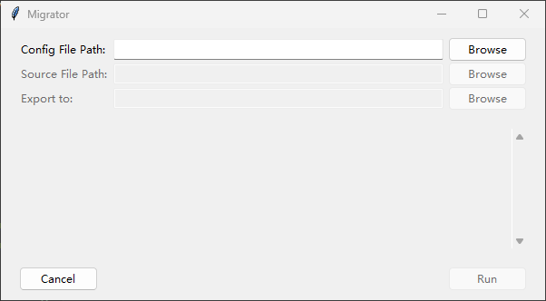
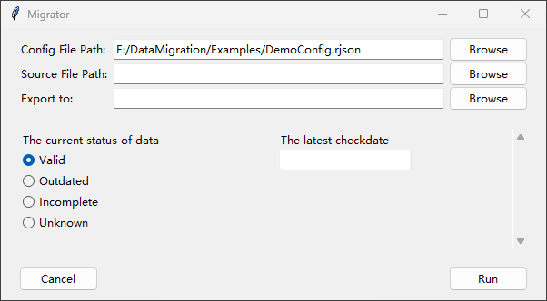

# Aboud .rjson Config File

rjson is a variation of relaxed json, designed for quick and easy writing, following a few simple rules:

- All standard JSON is valid.
- To keys and values without `'",:[]{}`, the quotes can be optional. (spaces are allowed)
- Commas cannot be omitted between objects paires and array items. (which is different from the mainstream rjson)
- Space must be added after commas and colons before unquoted keys or values.

Basically, the script would first convert rjson into standard json format, and then parse them with python builtin json parser.

## How to load rjson

### GUI

When GUI is launched, initially it looks like:



Click the Browse button in the left of the first line, at the right of "Config File Path" text, a file selection box will pop up to choose the rjson file.

### Python Script

``` Python
from os import PathLike
from DataMigrator.database import Database
from DataMigrator import migration_toolkit as mt

read_path: PathLike = "./Examples/src_data.xlsx"
save_path: PathLike = "./Examples/output.xlsx"
config_path: PathLike = "./Examples/DemoConfig.rjson"
    
# Import the .xlsx file to a Database object, which store and manage the imported data.
src_db: Database = Database.import_from_xlsx(read_path)
    
# Migrate data from src_db to write_db (another Database object returned by the function),
# using the config at config_path ("./Examples/DemoConfig.rjson" in this case)
# In the following example code, code other than this line will be omitted.
write_db: Database = mt.execute_migration(config_path, src_db)

# Export the Database object to a .xlsx file.
write_db.export_to_xlsx(save_path)
```

The function `migration_toolkit.execute_migration()` has two necessary augments: the first one is the path of .json file, and the second one is the Database object of source data.

## Basic structure of rjson

``` rjson
{
    additional_input: 0,
    args: [ ... ],
    process: { ... },
    sheets: [ ... ]
}
```

- **additional_input**: (Optional) How many extra source file should this migration involves, 0 by default for 1 source file input. For example, if you want 5 file inputs, this value should be 4. About how to use additional source data when processing, see [Escape Characters of Sheet Names](#Escape Characters of Sheet Names).
- **args**: (Optional) The list of arguments that is passed to the migration process. See [args](#args).
- **process**: (Optional) Contains the pre and post process to data that would apply to data. See [pre- and post- processing](#Pre- and Post- Processing).
- **sheets**: The core instuction of how to transfer data from sheet to sheet. It is a list contains a series of [Sheets Configs](#Struct of Sheet Configs), the number of which determins how many sheets you want in the exported excel file.

### args

Currently two types of args are supported: choice, text. Choice is to choose a single item from a limited list, and text is simply input a string of text.

For example, if you want to give a choice argment with choices (Valid, Outdated, Incomplete and Unknown) and a text argments, you can do something like:

``` rjson
...
args: [
    {
        description: The current status of data,
        type: choice,
        options: [Valid, Outdated, Incomplete, Unknown]
    },
    {
        description: The latest checkdate,
        type: text
    }
]
```

if you load a config file that contains the args above in the Migrator GUI (Click Browse button on the first line), you can see the args appears in the middle.



If you want to pass argment through Python, you can write:

``` Python
from os import PathLike
from DataMigrator.database import Database
from DataMigrator import migration_toolkit as mt

read_path: PathLike = "./Examples/src_data.xlsx"
save_path: PathLike = "./Examples/output.xlsx"
config_path: PathLike = "./Examples/DemoConfig.rjson"

src_db: Database = Database.import_from_xlsx(read_path)
# In the following example code, the above code is omitted
write_db = mt.execute_migration(config_path, src_db, args=["Valid", "20240320"])
write_db.export_to_xlsx(save_path)
```

To know about how to use these args migrating data, see [Escape Character for args]()

## Struct of Sheet Configs

``` rjson
{
    name: Iris Data,
    columns: [ ... ]
}
```

- **name**: the name of the sheet
- **columns**: A list contains a series of [Column Configs](#Column Configs), each correspond a column in the output.

## Column Configs

``` rjson
{
    title: Height,
    comment: The height of each plant
}
```

- **title**: the title of the column which is the text at the first row of each column when exported.
- **comment**: (Optional) A comment just to remind yourself what to do with this column. If you run `write_db.export_to_xlsx(save_path, add_comment=True)`, the comment would also be exported.

This demo just means an empty column. There are currently five column types supported: EmptyColumn, [FilledColumn](#Filled Column), [IndexColumn](#Index Column), [PastedColumn](#Pasted Column) and [Column With Scripts](#Column With Scripts).

### Filled Column

``` rjson
{
    title: Genus,
    fill_with: Iris
}
```

If a column config has the key "fill_with", the column is judged to be a Filled Column, which is filled with the "fill_with" value, in this case "Iris".

### Index Column

``` rjson
{
    title: Serial Number,
    index_start: 1
}
```

If a column config has the key "index_start", the column is judged to be an Index Column, which is like [index_start, index_start+1, index_start+2, ... ], in this case [1, 2, 3, 4, ... ]

### Pasted Column

``` rjson
{
    title: Species,
    copy_from: [Iris, Species]
}
```

If a column has the key "copy_from", the column is judged to be a Pasted Column, which directly copy a column from the source Database. The "copy_from" value is a list of [SheetName, ColumnTitle]

#### Mapping in Pasted Column

``` rjson
{
    title: Species Abbreviation,
    copy_from: [Iris, Species],
    mapping: {setosa: sts., versicolor: vsc., virginica: vgc., _Other: _Origin}
}
```

If a Pasted Column has the key "mapping", the data will be mapped after pasting. For example, if this is the original column in the Iris sheet:

|Species|
| ---- |
| virginica |
| scariosa |
| versicolor |
| setosa |
| versicolor |

After copying and mapping, the column would be like this in the output:

|Species Abbreviation|
| ---- |
| vgc. |
| scariosa |
| vsc. |
| sts. |
| vsc. |

If the string don't match any of the keys, the value would be mapping["_Other"]; if the value is _Origin, the string would remain unchanged.

#### Lambda Mapping in Pasted Column

``` rjson
{
    title: First Three Letters of Species,
    copy_from: [Iris, Species],
    mapping: "lambda s: s[:3]"
}
```

Mapping the Pasted Column also surpport lambda expressions (the same format as [the one in Python](https://docs.python.org/3/reference/expressions.html#grammar-token-python-grammar-lambda_expr)). The lambda expression is expected to receive a string argment and return a string value.

#### Escape Characters of Sheet Names

- **\_This**: If you want to copy a column from the target database itself, add "\_This." before the SheetName. example: [\_This.Iris Data, Serial Number]. There is no need for you to worry what if the column I want to copy from is below the reference, since DataMigrator would automatically change the order of processing (do not affect the order of columns in the output).

- **\_Add**: If you want to copy a column from additional input source data, add "\_Add0." for the first additional source data, add "\_Add1." for the second additional source data...


## Scripts in .rjson

For the utmost flexibitily and utility, Python scripts are supported in pre- and post-processing and processing columns.

### Column with Scripts

When a column needs data from multiplt columns, and there might be a complicated logic. Don't need to worry, as Column with Scripts is designed for this case.

For example, if I want to get the maximum value of three columns, I can write the column config like:

``` rjson
{
    title: Maximum of Three Columns,
    comment: Meaningless data and just for demostration,
    dependence: [
    	[Iris, Sepal Length],
		[Iris, Sepal Width],
		[Iris, Petal Length]
    ],
	script: "for i in range(l):\n\ttgt[i] = max(dpd[0][i], dpd[1][i], dpd[2][i])"
}
```

The script is executed with the context of following variables:

- **dpd**: The list of data from dependence columns. For example, dpd\[0\]\[4\] is the fifth data from the first dependence column, which is \[Iris, Sepal Length\]
- **l**: The length of the data from first dependence columns, literally `len(dpd[0])`
- **tgt**: The target data that is going to write into the output column. All values are `None` by default.
- **args**: A list of args passed to the DataMigrator.

If you have a really complex logic and very long code, it would be terrible to write them in a line. So, I'd like to introduce you -- The "Pjshon" (?), which is a weird format that allows you to pack Python script into an object in json.

For instance, if you have a script like this:

``` Python
last = None
ind = 0
for i in range(l):
    if dpd[0][1] == last:
        ind += 1
    else:
        last = dpd[0][i]
        ind = 1
    tgt[i] = ind
```

I can write Pjshon like:

``` Pjshon
script: [
    last = None,
    ind = 0,
    { for i in range(l): [
        { "if dpd[0][1] == last":
            ind += 1,
        else: [
            "last = dpd[0][i]",
            ind = 1
        ]},
        tgt[i] = ind
    ]}
]
```

Remember to add quotes manually to expressions with `'",:[]{}`, and be careful with the commas.

### Pre- and Post- Processing

Except in columns, you can also use scripts to pre- or post- process your data.

### Pre-Processing

The pre-processing script is executed before any column being processed, and it is within the context of following variables:

- **config**: A dict represents the whole .rjson file, contains all config information in it
- **src_db**: The source Database object
- **ex_src_db**: A list of additional source Database objects
- **args**: A list of args passed to the DataMigrator.

### Post-Processing

The post-processing script is executed after all column being processed, and it is within the context of following variables:

- **config**: A dict represents the whole .rjson file, contains all config information in it
- **src_db**: The source Database object
- **ex_src_db**: A list of additional source Database objects
- **tgt_db**: The target Database that finished migrating and ready to return
- **args**: A list of args passed to the DataMigrator.